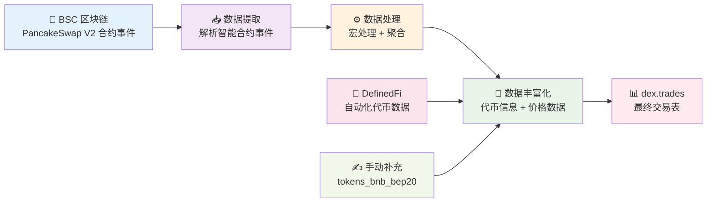

# PancakeSwap V2 BSC 完整数据血缘关系

## 概述
以 PancakeSwap V2 为例，展示 BSC 上 DEX 交易数据从区块链事件到最终 `dex.trades` 表的完整处理流程。
dex.trades doc: https://docs.dune.com/data-catalog/curated/dex-trades/evm/dex-trades#dex-trades

## 数据流向概览



## 完整数据流向图

## 详细血缘分析

### 1. 区块链事件层
**原始数据源**: BSC 区块链上的智能合约事件
- `PancakePair_evt_Swap`: 标准 V2 AMM 交换事件
- `PancakeFactory_evt_PairCreated`: 交易对创建事件  
- `PancakeSwapMMPool_evt_Swap`: 做市商池交换事件
- `PancakeStableSwap_evt_TokenExchange`: 稳定币交换事件

### 2. 数据源定义层
**文件**: `sources/pancakeswap/bnb/pancakeswap_v2_bnb_sources.yml`
```yaml
sources:
  - name: pancakeswap_v2_bnb
    tables:
      - name: PancakePair_evt_Swap
      - name: PancakeFactory_evt_PairCreated
      - name: PancakeSwapMMPool_evt_Swap
      - name: PancakeStableSwap_evt_TokenExchange
```

### 3. 宏处理层
**位置**: `dbt_subprojects/dex/models/trades/bnb/platforms/pancakeswap_v2_bnb_base_trades.sql`

#### 三种处理逻辑:
1. **标准 V2 交易**: `uniswap_compatible_v2_trades` 宏
   - 处理 `PancakePair_evt_Swap` 事件
   - 通过 `PancakeFactory_evt_PairCreated` 获取代币对信息
   - 解析 `amount0In/Out`, `amount1In/Out` 确定买卖方向

2. **MMPool 交易**: 直接 SQL 逻辑
   - 处理 `PancakeSwapMMPool_evt_Swap` 事件
   - 用户 vs 做市商交易模式
   - ETH 地址转换为 WBNB

3. **StableSwap 交易**: 直接 SQL 逻辑
   - 处理稳定币交换事件
   - 通过工厂合约关联获取代币信息

### 4. 平台级聚合
**输出**: `pancakeswap_v2_bnb_base_trades`
- 将三种交易类型通过 `UNION ALL` 合并
- 统一字段格式: `token_bought_amount_raw`, `token_sold_address` 等
- 版本标识: `version = '2'/'mmpool'/'stableswap'`

### 5. 链级聚合  
**文件**: `dbt_subprojects/dex/models/trades/bnb/dex_bnb_base_trades.sql`
- 包含 BSC 上所有 30+ DEX 协议
- PancakeSwap V2 是其中一个 `ref('pancakeswap_v2_bnb_base_trades')`

### 6. 全链聚合
**文件**: `dbt_subprojects/dex/models/trades/dex_base_trades.sql`  
- 合并所有 47 个区块链的交易数据
- BSC 数据来自 `ref('dex_bnb_base_trades')`

### 7. 数据丰富化
**宏**: `enrich_dex_trades()`
**过程**:
```sql
-- 1. 添加代币元数据
LEFT JOIN tokens.erc20 ta ON ta.blockchain='bnb' AND ta.contract_address=token_bought_address
LEFT JOIN tokens.erc20 tb ON tb.blockchain='bnb' AND tb.contract_address=token_sold_address

-- 2. 计算实际数量  
token_bought_amount = token_bought_amount_raw / pow(10, ta.decimals)
token_sold_amount = token_sold_amount_raw / pow(10, tb.decimals)

-- 3. 添加 USD 价值
LEFT JOIN prices.usd_with_native p ON p.blockchain='bnb' AND p.contract_address=token_bought_address
```

### 8. 代币数据来源
**BSC 代币元数据** (`tokens.erc20` WHERE `blockchain='bnb'`):
- **主要来源**: `dune.definedfi.dataset_tokens` (自动化)
- **补充来源**: `tokens_bnb_bep20.sql` (手动维护 62 个代币)
- **合并逻辑**: 自动化数据优先，补充数据填补空缺

### 9. 最终输出
**表**: `dex.trades`
**PancakeSwap V2 数据过滤**:
```sql
WHERE blockchain = 'bnb' 
  AND project = 'pancakeswap' 
  AND version IN ('2', 'mmpool', 'stableswap')
```

## 关键技术特点

### 增量处理
- 所有层级都支持增量更新
- 使用 `incremental_predicate('block_time')` 只处理新数据

### 数据质量
- 唯一键约束: `['tx_hash', 'evt_index']`
- 代币地址标准化 (ETH → WBNB 转换)
- 价格数据验证通过 `trusted_tokens`

### 性能优化  
- 按 `block_month` 分区
- Delta 文件格式
- 合并策略优化

---

这个完整的血缘关系展示了 PancakeSwap V2 交易数据如何从 BSC 区块链事件，经过多层处理和丰富化，最终形成标准化的交易记录，其中代币信息主要依赖 DefinedFi 的自动化数据源。
