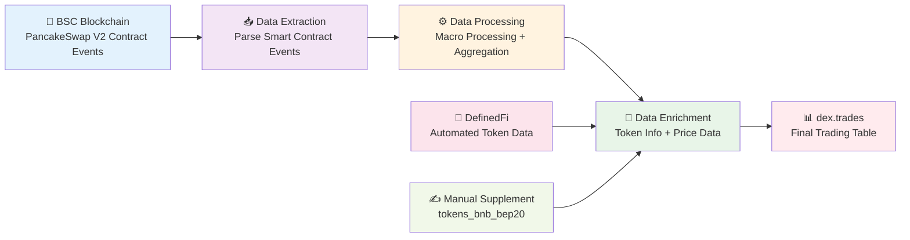
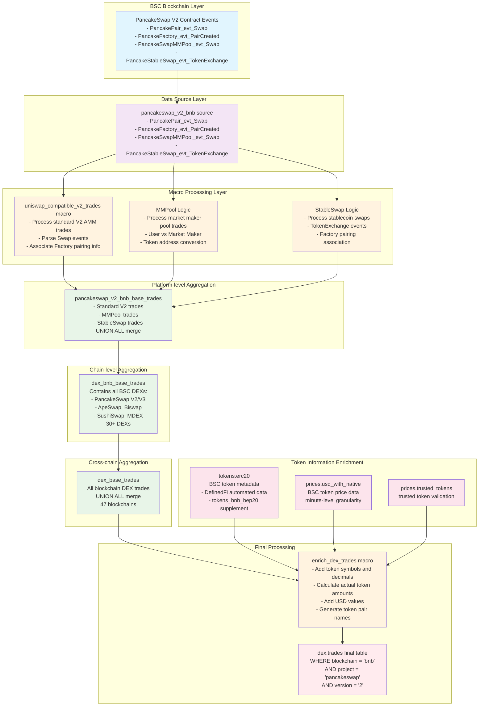

# PancakeSwap V2 BSC Complete Data Lineage

## Overview
Using PancakeSwap V2 as an example, this document demonstrates the complete processing flow of BSC DEX trading data from blockchain events to the final `dex.trades` table.
dex.trades doc: https://docs.dune.com/data-catalog/curated/dex-trades/evm/dex-trades#dex-trades

## Data Flow Overview



## Complete Data Flow Diagram



## Detailed Lineage Analysis

### 1. Blockchain Event Layer
**Raw Data Source**: Smart contract events on BSC blockchain
- `PancakePair_evt_Swap`: Standard V2 AMM swap events
- `PancakeFactory_evt_PairCreated`: Trading pair creation events  
- `PancakeSwapMMPool_evt_Swap`: Market maker pool swap events
- `PancakeStableSwap_evt_TokenExchange`: Stablecoin swap events

### 2. Data Source Definition Layer
**File**: `sources/pancakeswap/bnb/pancakeswap_v2_bnb_sources.yml`
```yaml
sources:
  - name: pancakeswap_v2_bnb
    tables:
      - name: PancakePair_evt_Swap
      - name: PancakeFactory_evt_PairCreated
      - name: PancakeSwapMMPool_evt_Swap
      - name: PancakeStableSwap_evt_TokenExchange
```

### 3. Macro Processing Layer
**Location**: `dbt_subprojects/dex/models/trades/bnb/platforms/pancakeswap_v2_bnb_base_trades.sql`

#### Three Processing Logic Types:
1. **Standard V2 Trades**: `uniswap_compatible_v2_trades` macro
   - Process `PancakePair_evt_Swap` events
   - Get token pair info through `PancakeFactory_evt_PairCreated`
   - Parse `amount0In/Out`, `amount1In/Out` to determine buy/sell direction

2. **MMPool Trades**: Direct SQL logic
   - Process `PancakeSwapMMPool_evt_Swap` events
   - User vs Market Maker trading model
   - ETH address conversion to WBNB

3. **StableSwap Trades**: Direct SQL logic
   - Process stablecoin swap events
   - Get token info through factory contract association

### 4. Platform-level Aggregation
**Output**: `pancakeswap_v2_bnb_base_trades`
- Merge three trade types via `UNION ALL`
- Standardize field formats: `token_bought_amount_raw`, `token_sold_address`, etc.
- Version identification: `version = '2'/'mmpool'/'stableswap'`

### 5. Chain-level Aggregation  
**File**: `dbt_subprojects/dex/models/trades/bnb/dex_bnb_base_trades.sql`
- Contains all 30+ DEX protocols on BSC
- PancakeSwap V2 is one `ref('pancakeswap_v2_bnb_base_trades')`

### 6. Cross-chain Aggregation
**File**: `dbt_subprojects/dex/models/trades/dex_base_trades.sql`  
- Merge trading data from all 47 blockchains
- BSC data comes from `ref('dex_bnb_base_trades')`

### 7. Data Enrichment
**Macro**: `enrich_dex_trades()`
**Process**:
```sql
-- 1. Add token metadata
LEFT JOIN tokens.erc20 ta ON ta.blockchain='bnb' AND ta.contract_address=token_bought_address
LEFT JOIN tokens.erc20 tb ON tb.blockchain='bnb' AND tb.contract_address=token_sold_address

-- 2. Calculate actual amounts  
token_bought_amount = token_bought_amount_raw / pow(10, ta.decimals)
token_sold_amount = token_sold_amount_raw / pow(10, tb.decimals)

-- 3. Add USD values
LEFT JOIN prices.usd_with_native p ON p.blockchain='bnb' AND p.contract_address=token_bought_address
```

### 8. Token Data Sources
**BSC Token Metadata** (`tokens.erc20` WHERE `blockchain='bnb'`):
- **Primary Source**: `dune.definedfi.dataset_tokens` (automated)
- **Supplementary Source**: `tokens_bnb_bep20.sql` (manually maintained 62 tokens)
- **Merge Logic**: Automated data takes priority, supplementary data fills gaps

### 9. Final Output
**Table**: `dex.trades`
**PancakeSwap V2 Data Filter**:
```sql
WHERE blockchain = 'bnb' 
  AND project = 'pancakeswap' 
  AND version IN ('2', 'mmpool', 'stableswap')
```

## Key Technical Features

### Incremental Processing
- All layers support incremental updates
- Use `incremental_predicate('block_time')` to process only new data

### Data Quality
- Unique key constraint: `['tx_hash', 'evt_index']`
- Token address standardization (ETH → WBNB conversion)
- Price data validation through `trusted_tokens`

### Performance Optimization  
- Partitioned by `block_month`
- Delta file format
- Optimized merge strategy

---

This complete lineage demonstrates how PancakeSwap V2 trading data flows from BSC blockchain events through multiple layers of processing and enrichment to form standardized trading records, with token information primarily relying on DefinedFi's automated data source.
